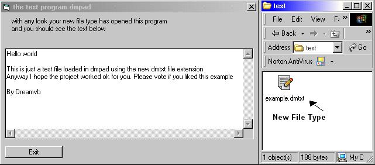



## have your own file type

### Description

Hi,

This little example will show a beginner how to create there own file type and have there program load up and open the file when clicked on like when you click on the .txt extension it opens note pad.

anyway there are to examples with this project the first one will install the Keys in the registery that you need also there is a remove part incase you wanted to remove them and the seconed project just shows how the new file type works anyway hope you find the code usfull.

please vote if you did.
 
### More Info
 

             |
---                |---
**Submitted On**   |2001-07-31 16:42:22
**By**             |[dreamvb](https://github.com/Planet-Source-Code/PSCIndex/blob/master/ByAuthor/dreamvb.md)
**Level**          |Beginner
**User Rating**    |5.0 (40 globes from 8 users)
**Compatibility**  |VB 5\.0, VB 6\.0
**Category**       |[Miscellaneous](https://github.com/Planet-Source-Code/PSCIndex/blob/master/ByCategory/miscellaneous__1-1.md)
**World**          |[Visual Basic](https://github.com/Planet-Source-Code/PSCIndex/blob/master/ByWorld/visual-basic.md)
**Archive File**   |[have\_your\_1130467312002\.zip](https://github.com/Planet-Source-Code/dreamvb-have-your-own-file-type__1-37469/archive/master.zip)

